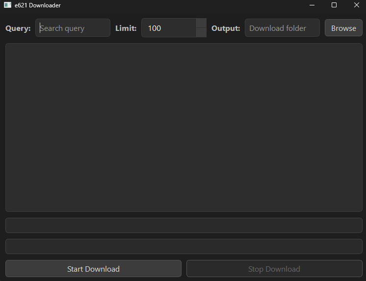
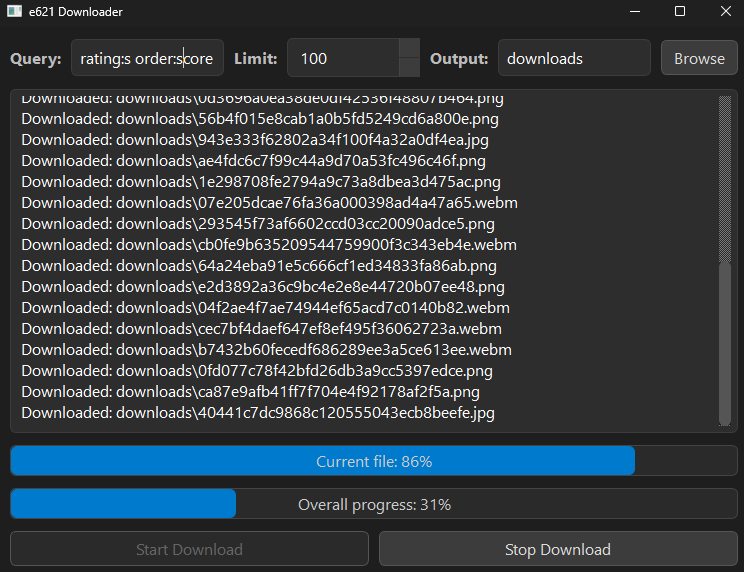
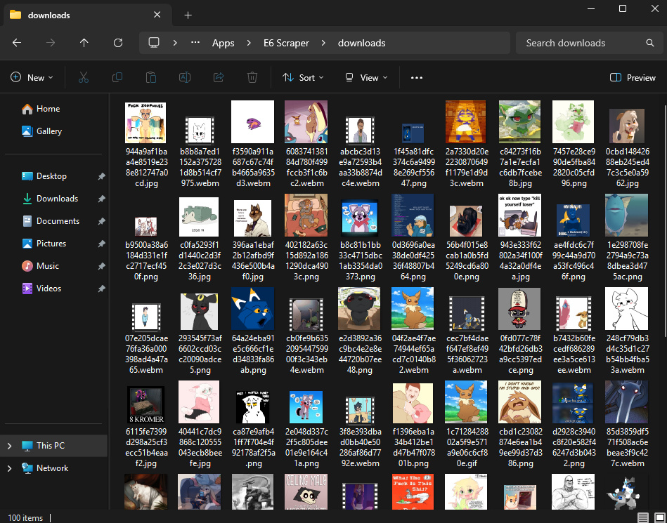

# E621 Post Scraper
A simple Python application with a QtPy GUI that downloads posts from [e621](https://e621.net/) based on your custom search query and post limit.

## Current features:
- Customizable query filtering (tags, score, rating, etc.)
- Progress bar showing overall download progress
- Scrollable log window displaying downloaded files
- Optional config file for advanced users
- Automatic fallback URL building for posts with missing direct URLs
- Works without user API key

## Running the Application
### Using the .exe (Recommended)
1. Download the latest exe file from the releases page
2. Double-click the exe to launch the GUI

*All logs and progress will appear in the GUI. Files will be downloaded to the folder specified in your config.*

### Screenshots

**Main GUI**  


**Log Window and Progress**  


**Folder Output**  


### Using Python (Optional)
If you want to run the Python version:
1. Install Python 3.10+ and [PySide6](https://pypi.org/project/PySide6/)
2. Clone this repository:
```
git clone https://github.com/SiverinO94/e6scraper.git
cd e6scraper
```
3. Run:
```
python main.pyw
```
## Notes
- If you need help with advanced tagging look at this official [cheatsheet](https://e621.net/help/cheatsheet)
- I have not heavily bug-tested this program so bugs/failures may occur